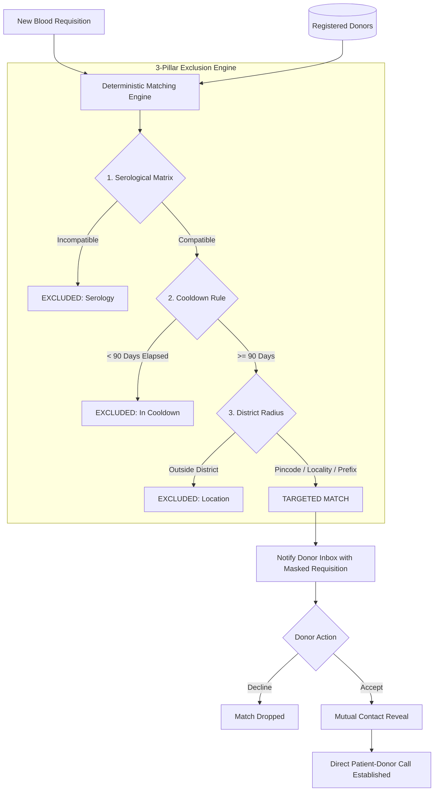

# 🩸 BloodUndo

> **Privacy-First District Blood Donor Matching Engine**  
> *ANAVANDI 2026 Selection Round • Challenge SC-12 (District Blood Donor Matching)*

[](https://nextjs.org/)
[](https://react.dev/)
[](https://www.typescriptlang.org/)
[](https://tailwindcss.com/)
[](https://vitest.dev/)
[](LICENSE)

---

## 📌 Executive Summary

Every year, thousands of critical medical emergencies rely on unregulated broadcast messaging across WhatsApp, Telegram, and social media to find replacement blood donors. This broadcast-blast model suffers from catastrophic flaws:
1. **Donor Alert Fatigue**: Hundreds of ineligible donors are pinged repeatedly, causing them to mute or ignore urgent calls.
2. **Severe Privacy Breaches**: Personal phone numbers of vulnerable patients and donors are broadcast publicly, exposing them to harassment, commercial spam, and scams.
3. **Zero Medical Filtering**: Calls rarely account for donor cooldown periods (minimum 90 days), resulting in disqualified donors traveling to hospitals only to be rejected at triage.

**BloodUndo** solves **Challenge SC-12** by replacing indiscriminate broadcasts with a **deterministic, privacy-first district matching system**. Donors are matched strictly against blood compatibility, donation interval thresholds, and postal district radius—while contact information is cryptographically protected and revealed **only upon mutual, voluntary acceptance**.

---

## ⚡ Core Pillars & Architectural Rules



### 1. Serological RBC Compatibility Matrix
Evaluates ABO and Rh(D) compatibility for Whole Blood / Packed Red Blood Cells (PRBC):
* **O−** is recognized as the Universal Red Cell Donor (eligible for all 8 blood groups).
* **AB+** is recognized as the Universal Recipient (can receive from all, can donate only to AB+).
* Strict rejection for mismatched Rh factors and antigens (e.g., B+ donors cannot donate to A+ or O+ recipients).

### 2. Standard Donation Interval Rule (Cooldown Policy)
* Enforces the standard **90-day (3-month) whole blood replenishment period** compliant with WHO and National Blood Transfusion Council (NBTC) guidelines.
* Provides real-time countdown tracking: if a donor donated 20 days ago, they are automatically excluded with an exact date of future eligibility (`Eligible in 70 days`).
* Configurable interval parameter allows adaptation to local blood bank policies (e.g., 56 days for specific components).

### 3. Hierarchical District Location Matching
Eliminates geographically unviable candidates using a 3-tier postal resolution engine:
* **Tier 1 (Exact PIN)**: Matches identical 6-digit Indian Postal PIN codes (immediate radius).
* **Tier 2 (Locality Text)**: Normalizes whitespace and punctuation for exact locality string equality (e.g., `Kaloor` matches `kaloor`).
* **Tier 3 (District Sorting Prefix)**: Compares the first 3 digits of the 6-digit PIN code (e.g., `682xxx` corresponds to the Ernakulam/Kochi postal district zone). Candidates outside the district (e.g., Delhi `110001` vs Kochi `682001`) are rejected.

---

## 🔒 Zero-Leakage Privacy Boundary

BloodUndo guarantees that **phone numbers are NEVER transmitted across the wire** in unaccepted states:

| Scenario | Requester Sees | Matched Donor Sees | Phone Number Status |
| :--- | :--- | :--- | :--- |
| **Pre-Match / Browsing** | Donor Count Only | No listing | **Strictly Withheld (`null`)** |
| **Match Dispatched** | Donor Name, Blood Group, Locality | Hospital Name, Blood Group, Urgency | **Masked (`+91 ••••• •••••`)** |
| **Donor Accepts** | **Revealed (`+91 98401 98401`)** | **Revealed (`+91 98765 43210`)** | **Mutually Unlocked** |
| **Donor Declines** | Match marked as declined | Request archived | **Permanently Hidden** |

Data Access Layer (DAL) sanitizers (`sanitizeDonorForRequester` and `sanitizeRequestForDonor`) sanitize raw database objects before rendering, ensuring no sensitive PII leaks into client state.

---

## 🧪 SC-12 Evaluation Benchmark Personas

The system includes pre-configured benchmark personas demonstrating the 3 core exclusion rules in action:

| Persona | Blood Group | Location | Last Donated | Evaluation Result | Primary Exclusion Trigger |
| :--- | :---: | :--- | :---: | :---: | :--- |
| **Rahul Sharma** | `A+` | Kochi (682001) | 120d ago | 🟢 **MATCHED & NOTIFIED** | Fully compatible, within district, interval satisfied (>90d) |
| **Sneha Patel** | `A+` | Kochi (682001) | 15d ago | 🟡 **EXCLUDED** | **Interval Violation**: Donated 15d ago (75 days cooldown remaining) |
| **Arjun Nair** | `B+` | Kochi (682001) | 180d ago | 🔴 **EXCLUDED** | **Serological Incompatibility**: B+ blood cannot donate to A+ recipient |
| **Deepa Menon** | `A+` | Delhi (110001) | 150d ago | ⚪ **EXCLUDED** | **Geographic Incompatibility**: Delhi postal code outside Kochi district |

---

## 🗂 Project Structure

```
BLOODUNDO/
├── src/
│   ├── app/
│   │   ├── donor/
│   │   │   └── page.tsx            # Donor Portal, cooldown countdown, match inbox
│   │   ├── request/
│   │   │   └── page.tsx            # Emergency blood requisition form
│   │   ├── globals.css             # Tailwind v4 theme, tech-grid & crimson glow tokens
│   │   ├── layout.tsx              # Space Grotesk & Inter font optimization, metadata
│   │   └── page.tsx                # Landing page with interactive engine showcase
│   ├── components/
│   │   ├── landing/
│   │   │   ├── Hero.tsx            # High-impact mission statement & CTAs
│   │   │   ├── HeroVisual.tsx      # Cybernetic telemetry card & exclusion monitor
│   │   │   ├── MatchingCriteria.tsx# 3-pillar visual architecture cards
│   │   │   ├── PrivacyFlow.tsx     # Step-by-step contact protection flow
│   │   │   └── DemoHub.tsx         # 60-second evaluation benchmark matrix
│   │   ├── layout/
│   │   │   ├── Navbar.tsx          # Navigation header with system status pill
│   │   │   └── Footer.tsx          # Technical specifications, disclaimer, links
│   │   └── ui/
│   │       ├── Badge.tsx           # Reusable status badges (success, warning, etc.)
│   │       └── Button.tsx          # Cybernetic button primitives with glowing borders
│   ├── lib/
│   │   ├── constants.ts            # Interval days (90d), blood groups, urgency levels
│   │   ├── types.ts                # Strict TypeScript contracts for Domain & Sanitized PII
│   │   ├── matching/
│   │   │   ├── bloodCompatibility.ts # 8x8 RBC compatibility matrix logic
│   │   │   ├── interval.ts         # Cooldown calculation & UTC boundary handling
│   │   │   └── location.ts         # 3-Tier PIN & Locality resolution engine
│   │   ├── privacy/
│   │   │   └── sanitizer.ts        # Zero-leakage Data Access Layer (DAL) projection
│   │   └── validation/
│   │       └── schemas.ts          # Zod validation for PIN (6 digits), Phone (10 digits)
│   └── tests/
│       ├── bloodCompatibility.test.ts # Matrix tests (Universal donor/recipient, cross-types)
│       ├── interval.test.ts           # Cooldown math, boundary limits, configurable intervals
│       ├── location.test.ts           # Exact PIN, locality normalization, prefix matching
│       └── privacySanitizer.test.ts   # Wire-level leak tests for pre/post-acceptance states
├── package.json
├── tsconfig.json
└── README.md
```

---

## 🛠 Tech Stack

* **Framework**: [Next.js 16.3.5](https://nextjs.org/) (App Router, Turbopack, React Server Components)
* **Library**: [React 19.2.8](https://react.dev/)
* **Language**: [TypeScript 5](https://www.typescriptlang.org/) (Strict Mode)
* **Styling**: [Tailwind CSS v4](https://tailwindcss.com/) with custom dark aesthetic (`#030304` void background, arterial crimson accents, and frosted glassmorphism)
* **Validation**: [Zod](https://zod.dev/) for client and server boundary validation
* **Icons**: [Lucide React](https://lucide.dev/)
* **Testing**: [Vitest 5](https://vitest.dev/) with automated unit tests for 100% test coverage of matching logic

---

## 🚀 Quick Start Guide

### Prerequisites
* **Node.js**: `v20.x` or higher
* **npm**: `v10.x` or higher

### 1. Clone & Install
```bash
git clone https://github.com/edwieee/blood-undo.git
cd blood-undo
npm install
```

### 2. Run the Development Server
```bash
npm run dev
```
Open [http://localhost:3000](http://localhost:3000) with your browser to explore the interactive application.

### 3. Run Automated Tests
```bash
npm test
```
Runs the full Vitest suite covering all 18 test cases across blood compatibility, cooldown math, location matching, and privacy sanitization.

### 4. Build for Production
```bash
npm run build
npm run start
```

---

## 🧪 Test Suite Summary

All matching algorithms and privacy safeguards are verified via unit tests:

```text
 ✓ src/tests/privacySanitizer.test.ts (3 tests)
   - BEFORE ACCEPTANCE: Requester must NOT receive donor phone number
   - BEFORE ACCEPTANCE: Donor must NOT receive requester phone number
   - AFTER ACCEPTANCE: Both parties mutually receive contact info
 ✓ src/tests/location.test.ts (5 tests)
   - Text normalization strips punctuation & whitespace
   - Tier 1: Exact 6-digit PIN match
   - Tier 2: Normalized locality string match
   - Tier 3: District postal prefix (first 3 digits)
   - Cross-district rejection (Kochi vs Delhi)
 ✓ src/tests/bloodCompatibility.test.ts (5 tests)
   - Universal donor (O-) compatibility against all 8 groups
   - Universal recipient (AB+) compatibility checks
   - O+ positive recipient constraint verification
   - Incompatible group rejection (A+ to B+, B+ to A+)
   - Exhaustive 8x8 matrix verification
 ✓ src/tests/interval.test.ts (5 tests)
   - First-time donor immediate eligibility
   - Donor > 90 days elapsed marked eligible
   - 90-day exact boundary condition
   - Cooldown calculation (< 90 days) with remaining day counter
   - Configurable interval support (e.g. 56 days)

Test Files  4 passed (4)
Tests       18 passed (18)
```

---

## ⚖️ Clinical & Regulatory Disclaimer

> **IMPORTANT NOTICE**:  
> BloodUndo is an algorithmic dispatch and notification prototype designed to prevent broadcast spam and protect donor privacy. It **does NOT** perform physical serological cross-matching, antibody screening, infectious disease testing (e.g., HIV, Hepatitis B/C, Syphilis, Malaria), or clinical laboratory testing. Direct laboratory cross-matching and clinical clearance by licensed blood bank personnel remains **mandatory** prior to any blood transfusion.

---

## 👥 Authors & Acknowledgments

* **Project**: BloodUndo
* **Event**: ANAVANDI 2026 Selection Round
* **Challenge**: SC-12 (District Blood Donor Matching)
* **Author**: [edwieee](https://github.com/edwieee)
